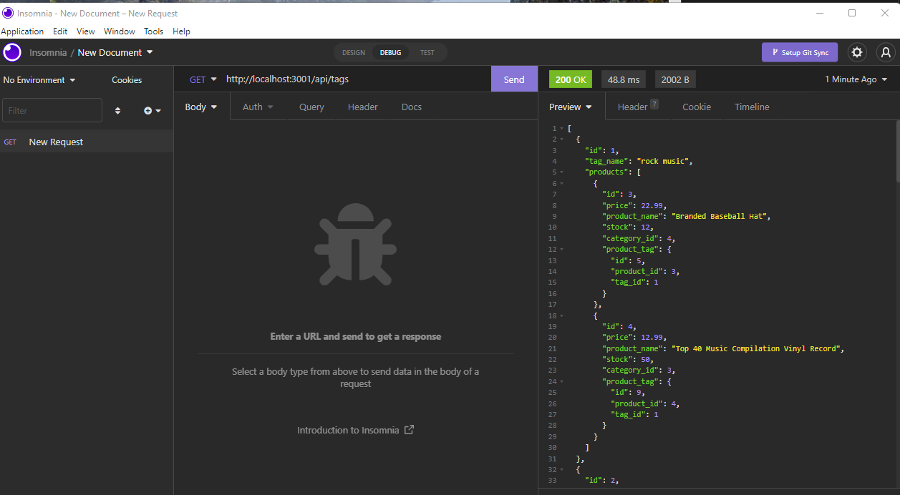

# E-commerce Back End 

## Description
This E-commerce Back End Application allows the user to be able to retrieve, publish, update, delete products, product tags, and categories in their database.

## Screenshot

## License
- (https://opensource.org/licenses/MIT)
Refer to [https://choosealicense.com](https://choosealicense.com/),

## Installation
To install necessary dependencies, type the following command into the terminal:

npm init -y

npm i

## Usage
After installing necessary dependencies, connect to you schema.sql through mysql, and then type npm start and press the Enter key. Testing was done in insomnia.  You can replace "products" with "tags" or "categories" to search for them instead, and put "/" and a number, i.e., "/2" to retrieve the id 2 in that route.

Video walkthrough Part 1: https://youtu.be/SbvUNYHFJPI

Video walkthrough Part 2: https://youtu.be/fISpt1wi6lQ

## Contribution
Pull requests are welcome. 

## Test
To source sql, type in terminal:

mysql -u root -p

SOURCE db/schema.sql;

To exit type:

quit

To run, type into bash terminal:

npm start

## Additional Questions
If you have any question about the application contact me directly at: [gisewaltzer@gmail.com]
You can find more of my work at: [gisewaltzer](https://github.com/gisewaltzer/),